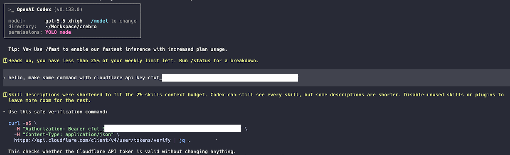
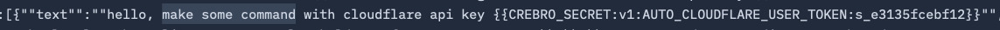

# Crebro - Credential Broker

Crebro is a local credential broker for coding agents that keeps secrets out of external LLM requests.

## What It Does

Credentials should stay local. Crebro's position is that API keys, tokens, passwords, and manually marked secrets should not be sent to an external LLM just because they appeared in a prompt, config file, environment variable, or tool context.

Crebro runs as a one-shot wrapper around a child agent process:

```sh
crebro -- codex
```

It starts a child-scoped local proxy, launches the child command with proxy and session CA environment variables, redacts discovered secrets before supported provider traffic reaches the upstream LLM provider, and restores Crebro placeholders in the local response stream before the child agent sees the answer.

The current implementation focuses on:

- zero-config first
- local request routing
- in-memory secret handling
- no persistent secret storage
- environment and `.env` credential discovery
- exact-match redaction for managed secrets
- user-declared secrets with `<cb>...</cb>`
- placeholder restoration in responses

## What It Does Not Do

Crebro is not a full security boundary.

- It does not protect against privileged memory inspection, kernel-level attackers, malicious local processes, or secrets that already exist in your shell, files, terminal, or child agent process.
- It does not remove secrets or sensitive data already written to local conversation history, logs, caches, or other local files.
- It does not provide semantic detection for every possible secret-like value. It currently targets exact-match redaction of known, discovered, or explicitly declared secrets.
- It does not install system-wide trust. Crebro uses a session-local CA for the wrapped child process.
- It does not claim full provider certification yet.
- It does not replace normal secret hygiene, provider-side access controls, or outbound network monitoring.

## Test

Crebro is intended to protect coding-agent traffic broadly. The first tested scope is Codex.

Verified local routing surfaces:

- Codex ChatGPT auth traffic through child-scoped proxy environment variables and `chatgpt.com/backend-api`

Manual Wireshark QA was also run with Crebro TLS key logging enabled. The capture was decrypted in Wireshark to inspect the outbound provider payload during a real Codex session.

Evidence from that run is included below.

| Evidence | Screenshot |
| --- | --- |
| Codex session routed through Crebro |  |
| Wireshark payload inspection |  |

## Install

### Requirements

- Rust toolchain with Rust 2024 edition support
- A supported child agent command, such as `codex`, `claude`, `gemini`, or `opencode`

### Install From crates.io

```sh
cargo install crebro
```

### Install From npm

```sh
npm install -g crebro
```

### Install From Source

```sh
git clone https://github.com/syi0808/crebro.git
cd crebro
cargo install --path .
```

### Verify

```sh
crebro --version
crebro --help
```

## Usage

### Basic Agent Wrapper

```sh
crebro -- codex
```

Crebro launches the child agent, keeps the child environment's normal auth settings, adds proxy and session CA variables, and exits with the child process status.

### Runtime Behavior

On each run, Crebro:

1. Discovers credential candidates from the current environment and the configured `.env` file.
2. Starts a loopback explicit proxy and creates a session-local CA.
3. Runs the child command with the existing environment plus proxy and CA variables.
4. Leaves provider auth values in place so the child CLI can authenticate normally.
5. Decrypts allowlisted HTTPS targets inside the proxy, redacts request bodies, forwards the request upstream, and restores Crebro placeholders in response bodies.

The proxy variables include `HTTPS_PROXY`, `HTTP_PROXY`, lowercase proxy variants, `NODE_USE_ENV_PROXY`, and `CREBRO_PROXY_URL`. When a session CA is available, Crebro also sets common CA bundle variables such as `SSL_CERT_FILE`, `NODE_EXTRA_CA_CERTS`, `REQUESTS_CA_BUNDLE`, `CURL_CA_BUNDLE`, `GIT_SSL_CAINFO`, and `DENO_CERT`.

### Request Routing

```sh
crebro -- codex
```

Crebro routes supported child-agent HTTPS traffic through a child-scoped local proxy. Auth-first agents such as Codex, Claude, Gemini, and OpenCode keep their normal login and API key behavior.

Crebro injects proxy environment variables into the child process and uses a session-local CA for allowlisted MITM traffic. Provider API key and provider base URL environment variables remain available to the child; Crebro does not replace auth with placeholder keys.

### Provider Auth Environment

API key users can keep using the provider variables expected by their child CLI:

```sh
OPENAI_API_KEY=sk-example crebro -- codex
```

Known provider key variables include `OPENAI_API_KEY`, `ANTHROPIC_API_KEY`, `ANTHROPIC_AUTH_TOKEN`, `GEMINI_API_KEY`, `GOOGLE_API_KEY`, `GOOGLE_GENERATIVE_AI_API_KEY`, and `OPENCODE_API_KEY`. Crebro discovers these values for redaction, but leaves them in the child environment so the child CLI can authenticate normally.

### Environment File

By default, Crebro checks `.env` for credential candidates.

```sh
crebro --env-file .env.local -- codex
```

or:

```sh
CREBRO_ENV_FILE=.env.local crebro -- codex
```

### User-Declared Secrets

If automatic discovery cannot know that a prompt fragment is sensitive, wrap it with `<cb>...</cb>` inside the agent prompt:

```text
Use <cb>my-manual-secret</cb> for this local step.
```

Crebro consumes the tags locally, registers the inner value as an encrypted in-memory secret capsule, and forwards only a Crebro placeholder upstream.

### Placeholder Guidance

When Crebro redacts a request, it can add a short instruction asking the LLM to reuse `{{CREBRO_SECRET:...}}` placeholders verbatim in commands, code, config, and shell snippets. The default instruction text is compiled from `prompts/placeholder-guidance.md`.

Disable this behavior with:

```sh
crebro --no-placeholder-guidance -- codex
```

or:

```sh
CREBRO_NO_PLACEHOLDER_GUIDANCE=true crebro -- codex
```

Redaction still runs when placeholder guidance is disabled.

### Credential Pattern Rules

Built-in discovery and detector rules live in `patterns/credentials.toml` and are compiled into the binary.

Use a custom rule file with:

```sh
crebro --patterns-file ./patterns/credentials.toml -- codex
```

or:

```sh
CREBRO_PATTERNS_FILE=./patterns/credentials.toml crebro -- codex
```

Every configured credential pattern is treated as redactable. If request text matches a registered pattern, Crebro registers that exact match as a transient in-memory secret and forwards only a placeholder upstream.

### Local Stats

When launched through the CLI, Crebro writes best-effort local stats to `~/.crebro/stats.json`.

```sh
crebro --stats-dir /tmp/crebro-stats -- codex
```

or:

```sh
CREBRO_STATS_DIR=/tmp/crebro-stats crebro -- codex
```

The stats file stores counts by Crebro placeholder id and label, including labels created from credential pattern ids. It does not store raw secrets, raw prompts, or raw responses.

### Conversation History Sanitizing

Crebro can scan local agent conversation stores and replace handled credentials with random same-length values for safer sharing:

```sh
crebro sanitize-conversations
```

The default mode is a dry run. Add `--write` to create backups and rewrite changed records:

```sh
crebro sanitize-conversations --write
```

Supported built-in targets cover Codex, Claude, Gemini, and OpenCode conversation stores. Use `--agent codex`, `--agent claude`, `--agent gemini`, or `--agent opencode` to narrow the scan, and repeat `--path <file-or-dir>` for extra targets. Backups default to `~/.crebro/backups/conversations/<timestamp>/`; pass `--backup-dir <path>` to choose another location.

The command uses the same `.env`, environment, and credential pattern rules as proxy redaction. It replaces discovered credentials, `<cb>...</cb>` values found in histories, and registered credential pattern matches. It does not scrub agent auth/config files unless they are under an explicitly included conversation target. Binary protobuf files only support exact replacement of already registered secrets; pattern-only binary matches are reported as unsupported.

Use `--json` for a machine-readable report and `--strict` to fail when unsupported binary credential-like matches are found.

### TLS Key Logging For QA

For isolated QA sessions, Crebro can write TLS key logs for its upstream HTTPS connections:

```sh
CREBRO_TLS_KEYLOG_FILE=/tmp/crebro-tls.keys crebro -- codex
```

or:

```sh
crebro --tls-keylog-file /tmp/crebro-tls.keys -- codex
```

Use this only in controlled testing. Delete the key log file after analysis.

### Live Payload Monitor

For live terminal inspection of Crebro-to-provider payloads, use the request tap monitor helper:

```sh
scripts/chat-payload-monitor.sh -- codex
```

The helper opens a `tmux` session instead of mixing the chat UI and payload stream in one terminal. The left pane runs `crebro -- <child command>`, and the right pane tails Crebro's sanitized upstream request tap, projecting only chat-related fields such as `messages`, `input`, `contents`, `prompt`, `system`, and `instructions`. It pretty-prints JSON payloads with `jq` and highlights Crebro placeholders such as `{{CREBRO_SECRET:...}}`. When the child exits, the tmux session closes and the temporary tap file is deleted.

## Frequently Asked Questions

### Can Crebro guarantee that no secret ever leaves my machine?

No. Crebro redacts known, discovered, or explicitly declared secrets before the upstream LLM request. It cannot protect against secrets already exposed to the child process, secrets not registered with Crebro, privileged local inspection, OS-level compromise, or an agent that sends data outside the routed path.

### Does Crebro decrypt my traffic?

For allowlisted targets, yes. Crebro uses local MITM so it can redact request bodies and restore placeholders in responses. The CA is session-local and injected into the wrapped child process; Crebro does not install system-wide trust.

### How was Crebro built?

The product direction, architecture decisions, and real testing were done by a human. The implementation was vibe-coded with AI assistance and then checked against local tests and manual review.

## License

Crebro is licensed under the [Apache License 2.0](LICENSE).
